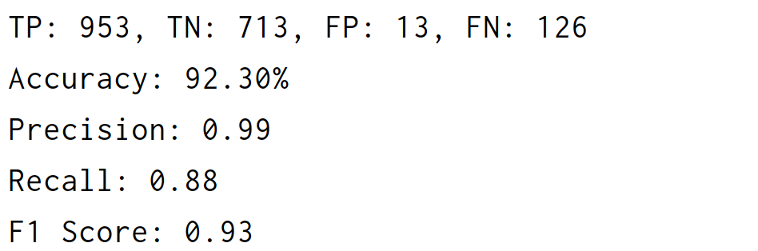

# 学习记录
  本人是零基础接触深度学习，没有找到《动手学习深度学习》，使用了清华大学出版社出版的《深度学习理论与应用》，通过几天的学习对神经网络有了一个大概的了解，在做题时同时借鉴书中的例子并在网上进行学习。

## 1.全连接神经网络
### 编写
  这个部分花费了近4天的时间，主要是对神经网络先有一个大致的了解。在着手解题时首先遇到的问题时怎么导入数据，翻看资料后，采用下载MNIST数据集的方法:  
`#加载MNIST数据集  `  
`train_dataset = datasets.MNIST('./data', train=True, download=True, transform=transform)`  
`test_dataset = datasets.MNIST('./data', train=False, transform=transform)`  

  最后由于不太熟练，卡在了如何取得TP、TN、FP、FN的值处，在学习之后，将预测的标签和真实标签分别添加到了两个列表中，即predicted_labels和true_labels，让后转为数组，使用NumPy的逻辑操作符得到了这四个值。
### 调试
  第一次测试的准确度达到了85%左右，此时的训练代数为5次，学习率为0.1，随后我将学习率下调到0.001并增加代数到10次，再次测试，准确度达到了98%，此处只放了最后测试的结果。
  

  
  
 
  
## 2.基本的RNN网络实现
### 编写
  这道题花费时间较少，大致框架与第一题相似，中间许多部分还是使用了书上的例子，增加了输出了内容，使得训练的过程更加可观。
### 测试
  测试了很多次，开始时准确率一直在88%左右，我尝试了增加学习率、增加训练代数、适当改变批量大小，最终准确率仍然在89%左右，最后一次测试中，我将批量设置为96，准确率得到了明显提高，达到92%。
  

  
  
 

## 3.Attention的理解和实现
  ### 正在写
